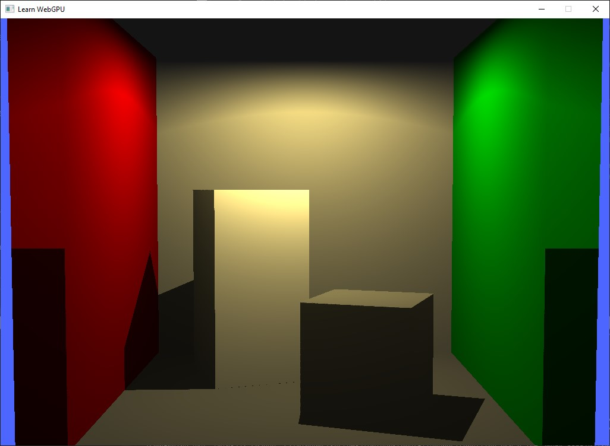

# DawnEngine
My Rudimentary Render engine in C++ using Google's DAWN Webgpu
Shaders are in HLSL -> SPIRV

## Requires
- DAWN - compile from googles source and copy over.
- FASTGLTF - folder install
- DXC - to compile to HLSL to SPIRV