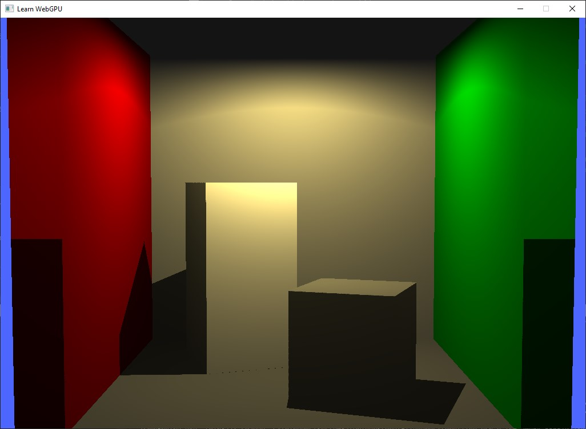

# DawnEngine
My Rudimentary Render engine in C++ using Google's DAWN Webgpu

Shaders are in HLSL -> SPIRV

## Requires
- DAWN - compile from googles source and copy over.
- VCPKG
- Models are taken from Khronos Gltf Sample Assets usually

## Install Instructions
1. git clone [this repo]
2. git submodule update --init --recursive
2. Make wgsl preprocessor executable
    i. cd build_tools/wgslPreprocessor folder
    ii. mkdir build
    iii. cd build
    iv. cmake -B . -S ../
    v. cmake --build .
3.  

# Build Instructions
1. mkdir build
2. cd build
3. cmake -B . -S ../ --preset vcpkg
4. cmake --build .

